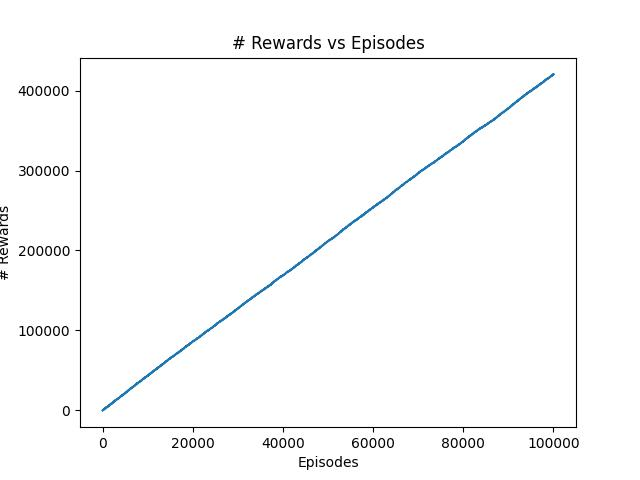

# Reply98 Team

<div align="center" style="max-width:68rem;">
<table>
  <tr>
    <td align="center"><a href="https://github.com/matheus-1618"><br /><sub><b>Matheus Oliveira</b></sub></a><br /><a href="https://github.com/matheus-1618" title="Matheus Silva M. Oliveira"></a> Developer</td>
   <td align="center"><a href="https://github.com/niveaabreu"><br /><sub><b>Nívea de Abreu</b></sub></a><br /><a href="https://github.com/niveaabreu" title="Nívea de Abreu"></a>Developer</td>
      <td align="center"><a href="https://github.com/leticiacb1"><br /><sub><b>Letícia Côelho</b></sub></a><br /><a href="https://github.com/leticiacb1" title="Letícia Côelho"></a>Developer</td>

  </tr>
</table>
</div>

### Install the infrastructure
For install the infrastructure:
```bash
python -m virtualenv venv
source venv/bin/activate
pip install -r requirements.txt

```

### For train the agent
For train the agent, run:
```bash
python3 trainQlearning.py
```

You can modify the hyperparams and the amount of episodes in the *trainQlearning.py* file.

### Testing the solution against MinMax:
For see the agent playing against the MinMax agent, run:
```bash
python3 tictac.py
```
Unfortunately the agent has a badly performance, drawing only in 40% of the matches.

Was used a different approach to train the model using biggest values of rewards for wins, draws and losts, but it yet didin't impact significantly it's perfomance. 
This is probably due to some inappropriate use of the environment or the hash function used, which does not allow the agent to learn all the optimal situations, since the test against MinMax, it seems to lose in some similar situations. The group cannot find a resolution for this unfortunately.

### Sum of Rewards over the episodes
Although the fact that the agent is seemingly learning over the time, this is not noticeable when he plays against an optimal solution agent.



